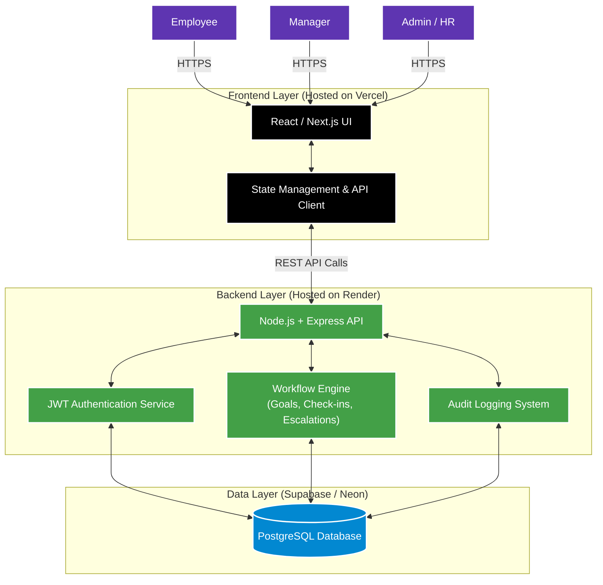

# Project Name: AtomTrack

A professional, enterprise-grade performance management web application built with **React/Next.js**, **Node.js/Express**, and **PostgreSQL**. AtomTrack enables organizations to define, track, and approve employee objectives through a structured quarterly appraisal cycle.

**🌐 Live Demo:** [https://atomtrack.vercel.app/](https://atomtrack.vercel.app/)

---

## Features

### Authentication & Roles
- **JWT Authentication** for secure sessions.
- **Role-based access control** supporting Employee, Manager, and Admin levels.
- Simulated Microsoft Entra ID (SSO) visual stub for enterprise integration.

### Phase 1 — Goal Creation & Approval
- **Goal Approval Workflow**: Employees create goal sheets with up to 8 goals.
- **Strict Validation**: Total weightage = 100%, minimum 10% per goal.
- **Manager Review**: Inline editing of targets and weightages; approve/lock goals or return for rework.
- **Shared KPIs**: Admin can push departmental goals to employees.

### Phase 2 — Achievement Tracking
- **Quarterly Check-in Workflow**: Log actual achievement vs. planned targets.
- **Progress Scoring**: Automated scoring with 4 formula types (Min, Max, Timeline, Zero-based).
- **Manager Comments**: Structured feedback on quarterly performance.

### Phase 3 — Reporting & Governance
- **Audit Logging System**: Complete log of post-lock goal changes (who, what, when) and escalation events.
- **Achievement Report**: Export Planned vs. Actual data as CSV.
- **Completion Dashboard**: Real-time view of employee & manager check-in status.

### Bonus Features
- **Analytics Dashboard**: QoQ trends, Completion Heatmaps, and Manager Effectiveness Radar charts.
- **Rule-Based Escalations**: Automated triggers for overdue goals or missed check-ins.
- **Notifications Engine**: Simulated Teams/Email alerts with deep-linking functionality.

---

## Tech Stack

| Component | Technology | Purpose |
|-----------|---------|---------|
| **Frontend** | React / Next.js (App Router), Tailwind CSS, shadcn/ui | User Interface & Client Logic |
| **Backend** | Node.js, Express | REST API, Business Logic |
| **Database** | PostgreSQL (Supabase / Neon) | Persistent Data Storage |
| **Authentication**| JWT | Secure User Sessions |
| **Visuals** | Recharts, Lucide React | Data Visualizations & Icons |
| **Hosting** | Vercel (Frontend), Render (Backend) | Cloud Deployment |

---

## Setup Instructions

```bash
# Clone the repository
git clone https://github.com/<your-username>/AtomTrack.git
cd AtomTrack/AtomTrack

# Install dependencies
npm install

# Start development server
npm run dev
```

Open [http://localhost:3000](http://localhost:3000) in your browser.

---

## Demo Credentials

Select a role card on the login page to auto-fill credentials, then click **Sign in**.

| Role | Name | Email | Password |
|------|------|-------|----------|
| **Employee** | Khushie Mohod | `khushie@atomtrack.com` | `Demo@123` |
| **Reporting Manager (L1)** | Sakshi Kuber | `sakshi@atomtrack.com` | `Demo@123` |
| **Admin / HR** | Shlok Chaudhari | `shlok@atomtrack.com` | `Demo@123` |

Additional seeded employees: Arjun Mehta (`arjun@atomtrack.com`) and Neha Gupta (`neha@atomtrack.com`).

---

## Architecture Overview

AtomTrack is designed as a decoupled enterprise application, separating the highly interactive frontend from the secure backend API layer.



### Flow Highlights
- **REST API Communication**: The React frontend securely communicates with the Node.js backend using standard REST principles and JSON payloads.
- **JWT Authentication**: Upon login, a JWT is generated and securely passed on all subsequent API requests.
- **Workflow Engine**: Enforces rules for the **Quarterly check-in workflow** and the **Goal approval workflow**, ensuring data integrity before writing to PostgreSQL.
- **Audit Logging System**: The backend intercepts critical actions (e.g., manager approvals, target edits) and writes immutable logs to the database.

---

## Deployment Configuration

**Deploying the Frontend to Vercel:**
1. Connect your GitHub repository to Vercel.
2. Set the Root Directory to `AtomTrack` (where `package.json` is located).
3. Ensure the Build Command is `npm run build` and Install Command is `npm install`.

**Deploying the Backend to Render:**
1. Connect the repository to Render as a Web Service.
2. Set the environment variables for `DATABASE_URL` and `JWT_SECRET`.
3. Configure the start command as `npm start` or `node server.js`.

---

## License

This project was built for the Hackathon demonstration. MIT License.